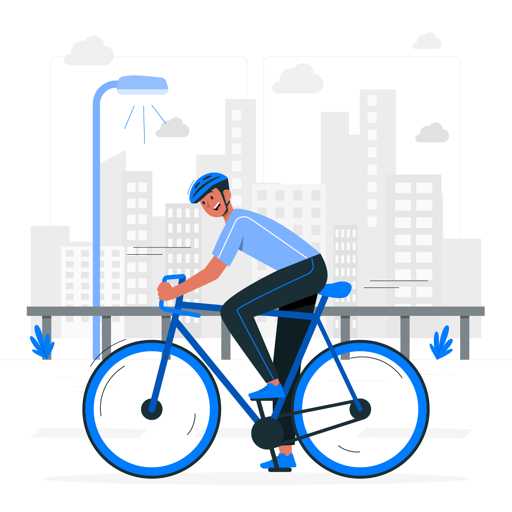

# Cyclistic Bike Sharing Analysis

  

## Introduction
### The Cyclistic Company

Cyclistic is a bike-sharing company in Chicago, United States that features more than 5,800 bicycles and 600 docking stations. Cyclistic sets itself apart by also offering reclining bikes, hand tricycles, and cargo bikes, making bike-share more inclusive to people with disabilities and riders who can’t use a standard two-wheeled bike. Cyclistic users are more likely to ride for leisure, but the users also use them to commute to work each day.

Until now, Cyclistic’s marketing strategy relied on building general awareness and appealing to broad consumer segments.
One approach that helped make these things possible was the flexibility of its pricing plans: single-ride passes, full-day passes, and annual memberships. Customers who purchase single-ride or full-day passes are referred to as casual riders. Customers who purchase annual memberships are Cyclistic members.

Although the pricing flexibility helps Cyclistic attract more customers, Cyclistic believes that maximizing the number of annual members will be key to future growth. Rather than creating a marketing campaign that targets all-new customers, Cyclistic believes there is a very good chance to convert casual riders into members.

### Problem Statement

Convert casual riders into Cyclistic members.

### Business Task

- Analyze how casual riders and annual members behaves differently.
- Support stakeholder to make data-driven decision-making to create campaign or strategies that attempt to convert casual riders into Cyclistic members.
  
## Insight and Recommendation
  
### Insight

Through analyzing the dataset, we have come to interesting conclusion:
- Most rides are being used by member riders. 
- Most riders prefer electric bike, and even more popular among casual riders.
- The number of rides reach its peaks during summer (in June, July, and August). This increase is mostly caused by high number of casual rider during summer.
- Member riders mostly rent a bike during weekday, while casual riders are mostly during weekends.
- At 8.00 in the morning and 17.00 in the afternoon is the "rush hour" for member riders. For casual riders, it's more spread out from morning to afternoon, and reach its peak at 17.00 in the afternoon.
- Casual riders spent more time riding a bike. On average, casual riders spent 28 minutes riding the bike each day, while member riders spent 12 minutes each day.
- The riding duration for member riders is stagnant during the week, while for casual members there is a rise in ride duration during weekend.
  
### Recommendation
  
1. Introduce Weekend Pass. The Weekend Pass is targeted to casual riders who mostly rent a bike during weekend. The Weekend Pass will have lower price point than the Annual Pass, but can only be used during Friday, Saturday, and Sunday.

2. Create a reward point campaign; give user reward points which accumulated by riding duration. Since casual riders ride duration is higher than current member riders, they will benefit more from this campaign. Offer them membership discount when they reach certain points to convert them into Cyclistic's member.

3. Perform strategic campaign during summer. Given the number of riders are at its annual peak in summer, we can do strategic campaign and advertising to reach more audience. 
  
Thank you for visiting my repository 🚴‍♂️🚴‍♂️🚴‍♂️
